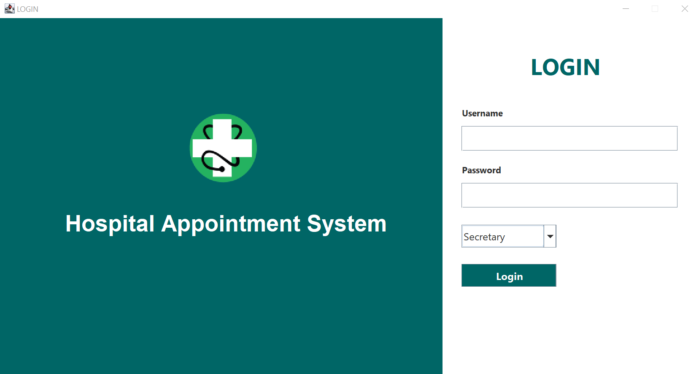
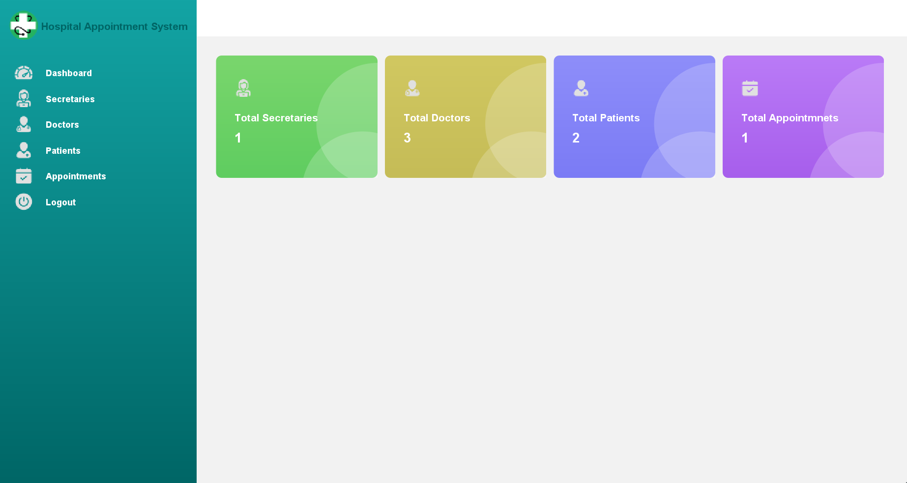
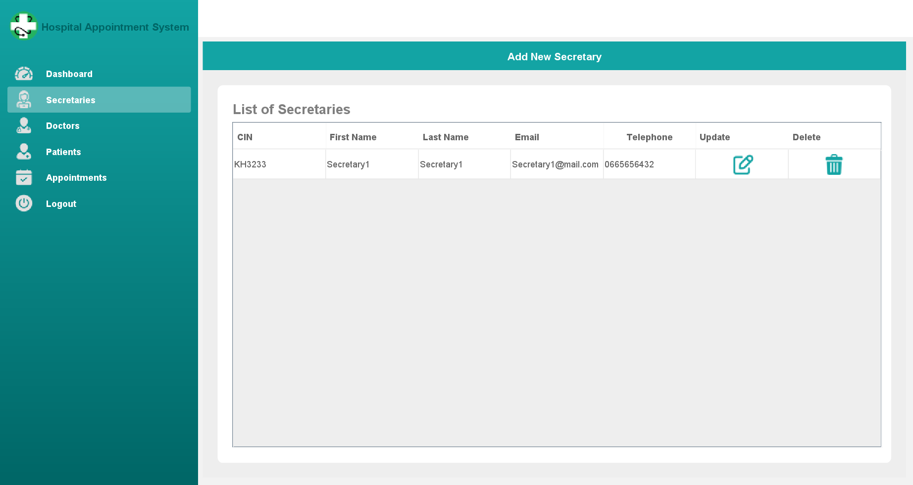
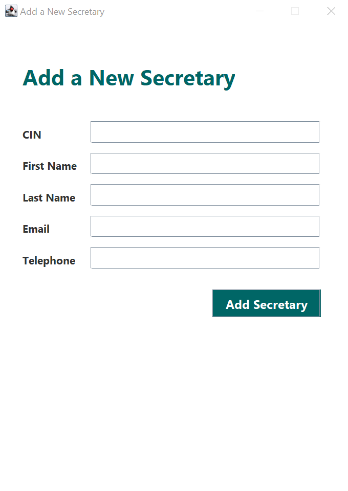
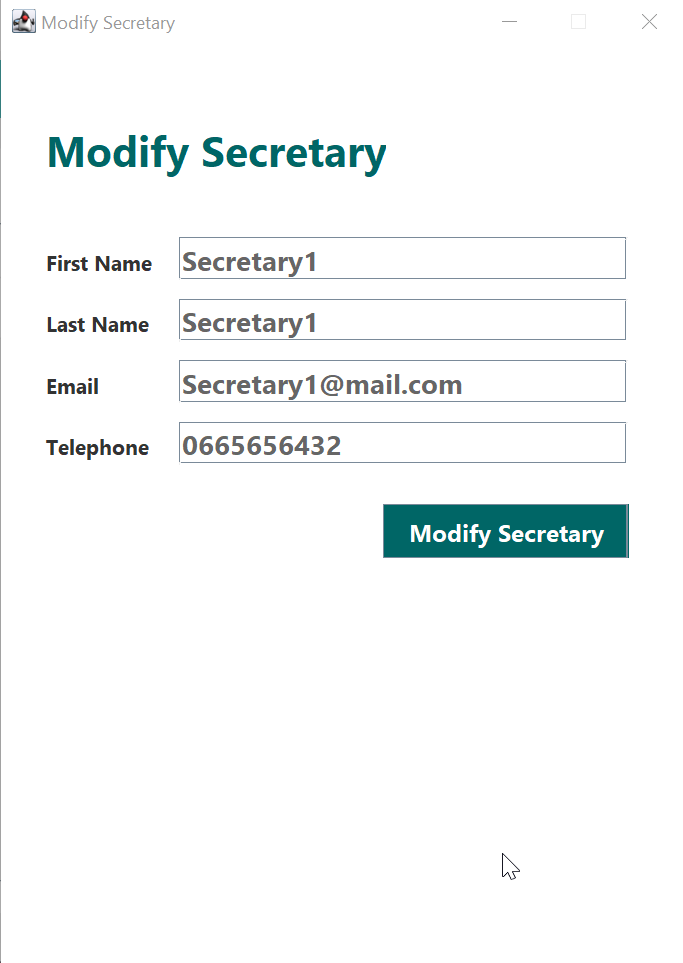
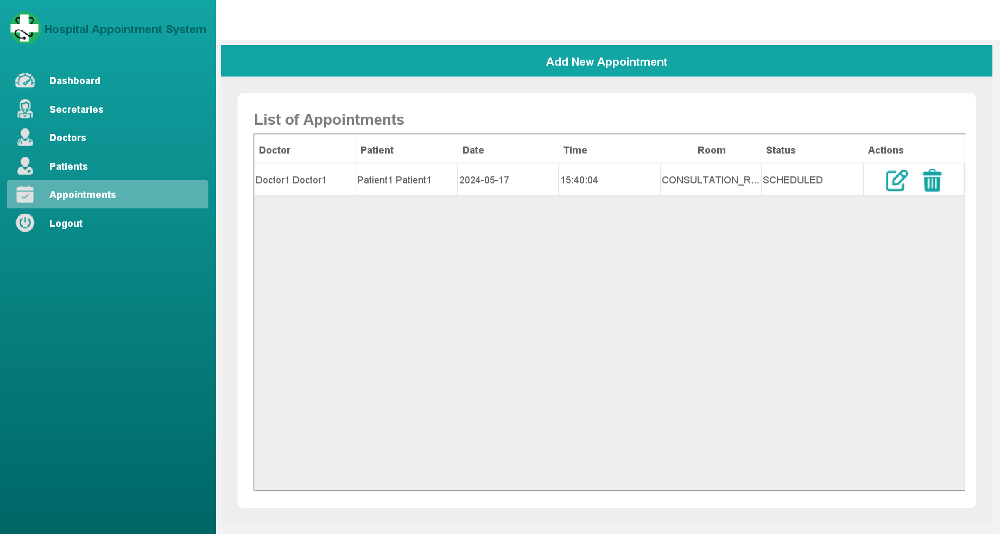
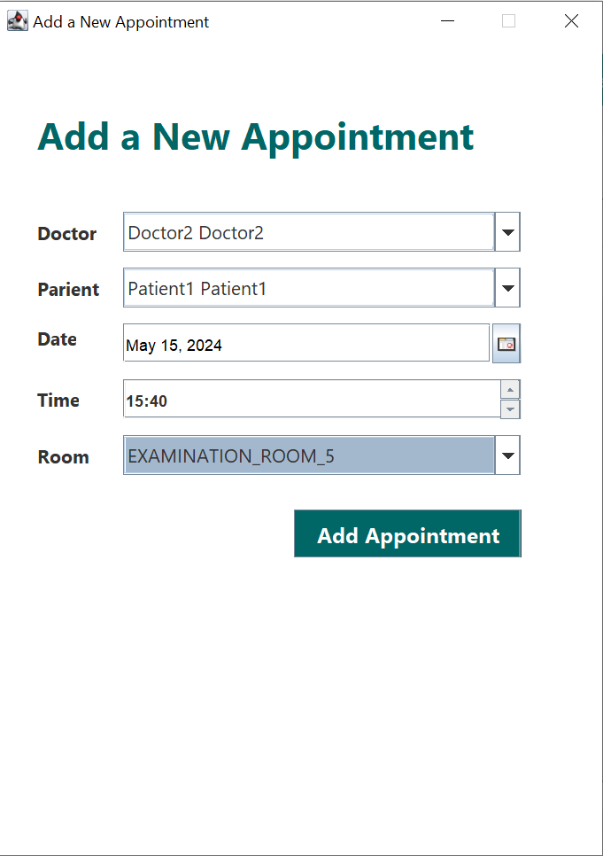

# Hospital Appointment System with Java Swing and MySQL

# Overview

This project is a Hospital Appointment System implemented in Java using the Swing framework for the user interface and MySQL for the database backend. It allows users such as secretary to manage patients and appointments, as well as an admin to manage doctors and secretaries

# Features
**User Authentication:** Users can log in with different roles (Admin, Secretary) to access relevant functionalities.

**Manage Patients:** Secretaries can manage patient information.

**Appointment Management:** Secretaries can schedule, modify, and cancel appointments.

**Manage Doctors:** Admins can add, edit, and delete doctor, including their specialties

**Manage Secretaries:** Admins can add, edit, and delete Secretaries.

**Database Integration:** Utilizes MySQL for storing user data, appointments, and other relevant information.

# How to run this project?

**Step 1:** **Download this Repository in your PC.**

**Step 2:** **Import Project in IntelliJ IDEA.**

**Step 3:** **Add JDBC Library** by Navigate to the MySQL Connector/J JAR file (You can find it on dist/lib directory or download it from official website) and add it to the project.

**Step 5**: **Add JCalendar Library** by Navigate to the JCalendar JAR file (You can find it on dist/lib directory or download it from official website) and add it to the project.

**Step 6:** **Database Configuration** by Create a new database named "hospital_appointment_system" and Import the provided SQL schema (database-tables.sql) into the database.

**Step 7:** **Update Database Connection Settings** by add the resources/config.properties file to the project and Modify the database connection properties (USERNAME, PASSWORD) to match your MySQL server configuration.

**Step 8:** **Build and Run the Application** by Navigate to the src/Main directory in IntelliJ IDEA.

# Screenshots

        
        
        
        

            
            
        

        
        
      

# Libraries used in this project

**JDBC Library:** https://dev.mysql.com/downloads/connector/j/

**JCalendar Library:** https://toedter.com/jcalendar/